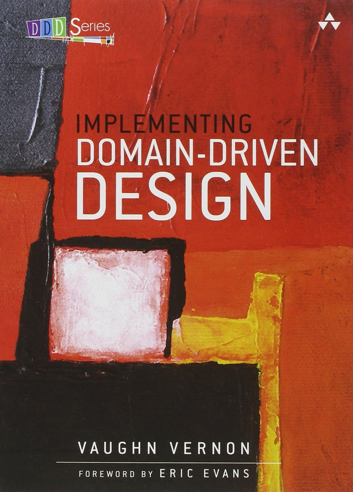
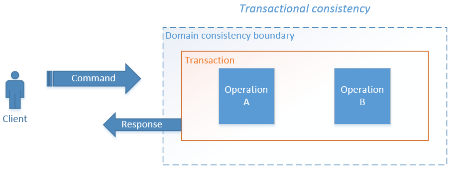
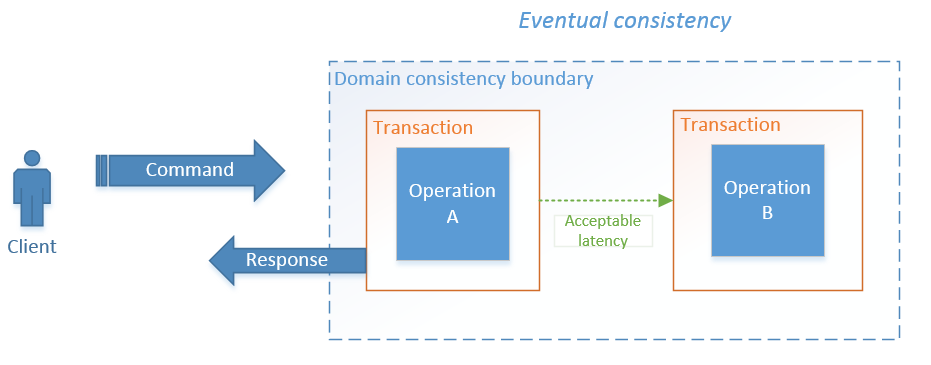
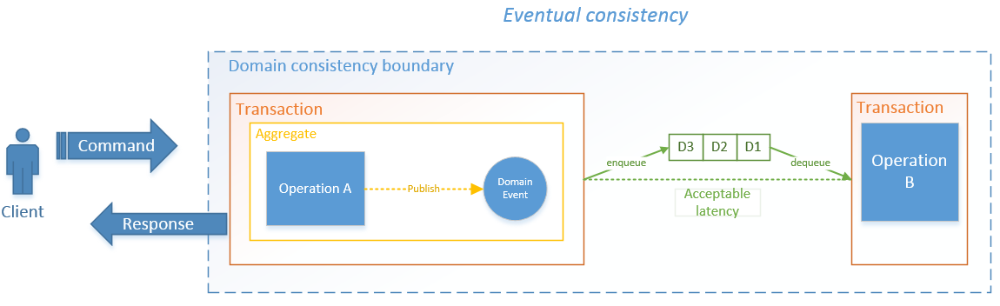
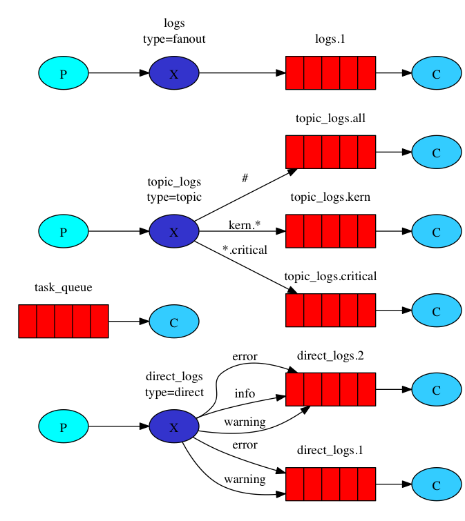
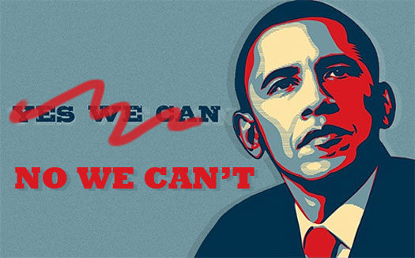

# PUBLIER DES
# DOMAIN EVENTS

**

# SANS RABBITMQ,
# C’EST POSSIBLE !

**

- DDD
  - Domain Event
  - Bounded Context
  - Consistance des données
- Broker
  - RabbitMQ
- Alternative au broker

Note: Nous allons donc vous parler de DDD et plus précisement etc...

***
###Julien Salleyron


@juguul

https://github.com/juliens

juliens@php.net


Note: On est des tueurs bla bla bla

**
###Simon Delicata

Lead développeur / Référent technique 
<br />_Alptis Assurances_

s.delicata@alptis.fr

http://www.afterglow.fr


Note:
- Bonjour à tous, je Simon Delicata, je suis lead developpeur et référent technique du pole web d'Alptis Assurances
- Dans une autre vie je suis également chanteur/guitariste d'un groupe de rock alternatif qui s'appelle AFTERGLOW

***

## DDD & Domain Events
Note: Pour commencer on va parler de DDD et des Domain Events

** 
###Domain Driven Design : Tackling Complexity...
*Eric Evans (2003)*
<div style="clear: both;"></div>

* Ubiquitous language
* Bounded context
* Model Driven Design
* Layered Architecture
* Anti Corruption Layer
* Entities
* Value Objects
* Aggregates

Note:
- Quand on parle de DDD, on pense tout de suite au livre d'Eric Evans (2003)
- Tout le monde a déjà entendu parlé de ce livre ? Ok. Tiens, et qui l'a lu parmis vous ?
- C'est vraiment un incoutournable, on le considère comme la bible du DDD
- Alors il est très théorique
- Mais il a le mérite d'aborder tous les concepts de base : ubiquitous...<!-- comme l'ubiquitous language, les bounded context, l'architecture hexagonale, des mots qui parlent aux PHPistes tels que entities, repositories, etc. -->
- Par contre, dans ce livre, __il n'y a pas de notion de Domain Event__

**
###Implementing Domain Driven Design
*Vaughn Vernon (2013)*
<div style="clear: both;"></div>

* Ubiquitous language
* Bounded context
* Model Driven Design
* Layered Architecture
* Anti Corruption Layer
* Entities
* Value Objects
* Aggregates
* **Domain Events**

Note: 
- C'est seulement 10 ans plus tard que Vernon (2013) introduit les Domain Events dans son livre "Implementing Domain Driven Design", IDDD pour les intimes
- Vous le connaissez celui-ci ? Qui l'a déjà lu ?
- Je vous le recommande vraiment, parce qu'il est moins théorique, il y a beaucoup d'exemples concrets, avec du code.
- Bon malheureusement ils sont en java...

**
### Domain Event : Kesako ?


Note: 
- Alors un Domain Event qu'est-ce que c'est ?
- Un Domain Event représente tout simplement un évenement __métier__ qui peut se passer dans la vie de notre application
- ex : l'utilisateur s'est authentifié, le client a changé d'adresse, l'article a été publié, etc
- Donc techniquement, un DE...
**

<!-- .slide: data-background="./img/images/message-bouteille.jpg" class="align-top" -->
###Un message publié <!-- .element: class="text-hover-image" -->
Note:
- C'est un message qu'on va __publier__
- L'image du slide est bien choisi, parce qu'on va le publier sans se préocupper de qui va le recevoir, ou pas d'ailleurs
- C'est un détail qui a son importance, on le vera plus tard

**
<!-- .slide: data-background="./img/images/past2.jpg" -->
###Représente un événement passé et daté <!-- .element: class="text-hover-image" -->
Note:
- Notre message représente un événement métier qui s'est déroulé __dans le passé__
- C'est très important, il ne faut pas le confondre avec une commande
- La commande va déclencher une action, alors que le DE serait plutôt la résultat de cette action
- Il a déjà eu lieu à un moment précis et on doit savoir exactement quand

**
<!-- .slide: data-background="./img/images/entity2.jpg" -->
###Lié à une entité ou un aggrégat <!-- .element: class="text-hover-image" -->
Note:
- Notre Domain Event concerne toujours une entité de notre domaine, ou encore un aggrégat
- ex: un utilisateur a changé de mot de passe, un produit a été acheté ou encore un post a été publié sur le forum, 
- Vous avez compris l'idée ?

**
<!-- .slide: data-background="./img/images/information.jpg" -->
###Contient les informations de l'évenement métier<!-- .element: class="text-hover-image" -->
Note:
- Il contient toutes les informations qui décrivent un changement d'état de notre entité
- ex: un client a changé d'adresse => l'id du client, mais aussi sa nouvelle adresse, et pourquoi pas l'ancienne
- ex: post sur le forum => l'id du post qui vient d'être publié, id de l'auteur, l'id de la catégorie et pourquoi pas celui du post parent

**
<!-- .slide: data-background="./img/images/back-to-the-future.jpg" class="align-top" -->
###Immutable<!-- .element: class="text-hover-image" -->
Note:
- Enfin, un Domain Event est par essence immutable
- C'est un objet dont l'état ne peut pas être modifié après sa création
- Ca semble logique étant donné qu'il représente un événement __passé__
- On ne peut pas réécrire l'histoire (sourir et regard vers le slide) ... quoi que...

**
```php
interface DomainEventInterface
{
    public function getType();
    public function getRootEntityId();
    public function occurredOn();
    public function getInformations();
}
```
Note:
- Pour terminer, voici un example de code représentant un Domain Event
- Il s'agit d'une interface
- Et le contrat nous dit qu'il doit être capable de retourner :
    - un type (pour pouvoir être filtré)
    - l'identifiant de l'entité concernée
    - la date à laquelle s'est déroulé l'événement
    - les infos qui décrivent le changement
- Pour terminer vous remarquerez qu'il n'y a que des getters => immutable

***

<!-- JulienS -->

## Les Bounded Contexts

**

Note: Le bouquin D'Eric Evans est composé de 2 parties bien distinct, les
patterns technique et les patterns stratégique, les gens ont souvent tendances
à connaitre les patterns technique (on est des techniciens après tout)

**
##Pattern technique
- Entity
- Aggregates
- Repository
- Value Object
- Domain Event

Note: Voici une liste non exhaustive de pattern technique, on reconnais les
patterns qui sont plus ou moins implémenté dans Doctrine

**
##Pattern stratégique
- Bounded Context
- ACL
- Ubiquitous Language
- ...

Note: Et voici des patterns stratégiques. Ici on voit le Bounded Context
**

<!-- .slide: data-background="./img/metier.jpg" -->
###Des environnements métiers<!-- .element: class="text-hover-image" --> 
**
<!-- .slide: data-background="./img/images/separation.jpg" -->
###Différents <!-- .element: class="text-hover-image" --> 

**
<!-- .slide: data-background="./img/images/isolated.jpg" -->
###Isolés <!-- .element: class="text-hover-image" -->

**
<!-- .slide: data-background="./img/images/coffee.jpg" -->
###Avec leur propre Ubiquitous Language <!-- .element: class="text-hover-image" -->

**
##Entity dans E-Boutique
 - Produit
 - Commentaire
 - Note
 - Commande
 ...

**
##Entity dans Stock-Fournisseur
 - Produit 
 - Fournisseur
 - Prix
 - Lieu (de stockage)
 ...


**
### Même language 


```
$a = "STRING";
```
###dans des contexts différents

Note: Des mots peuvent vouloir dire des choses différentes dans leur contexte,
quand je dis à ma fille de mettre ses brassards, je parle evidement de sa boué
et bien sure pas du stuff que j'ai looté hier dans Diablo 3

**
<!-- .slide: data-background="./img/drapeau.jpg" -->
###Identité <!-- .element: class="text-hover-image" -->

**
##Comment synchroniser tout ça ?

***
<!-- (SimonD) -->
## Consistance des données
Note: 
- Maintenant qu'on a nos BC bien distincts, se pose la question de la consistance des données

**
### Transactional Consistency

Note:
- Traditionnellement les applications étaient conçues sur des workflows transactionnels
- La plupart du temps les développeurs executent une commande, puis réalisent toutes les opérations pour maintenir le système consistant dans la même transaction
- ex: Un client paie une commande => on envoie un mail de confirmation, on déclenche la préparation de commande, on met à jour le stock, etc

**
<!-- .slide: data-background="./img/images/server-down2.jpg" -->
### Server Down<!-- .element: class="text-hover-image" -->
Note: 
- Oui mais alors qu'est ce qu'il se passe si le serveur d'envoi de mail est down ?
- On va se poser des question embarassantes du genre :
- Est-ce que la commande a quand même bien été validée ?
- Et l'email de confirmation, est-ce qu'il est perdu ? Est-ce qu'on va pouvoir le renvoyer une fois la panne résolue ?

**
<!-- .slide: data-background="./img/images/bad-ux4.jpg" -->
### Bad ux  :(<!-- .element: class="text-hover-image" -->
Note:
- Le client, lui, n'attend qu'un simple message de confirmation
- Est-ce que ça a du sens qu'il attende devant son écran jusqu'à ce que la préparation de la commande ait commencée ?
- Pas terrible comme expérience utilisateur...

**
### Eventual Consistency

Note:
- Dans un worklow éventuellement consistant, on accèpte l'idée que les BC ne soient pas toujours synchronisés
- On tolère une certaine latence
- Une transaction déclenchera __seulement__ les opérations nécessaires à maintenir la consistance des données au sein de notre aggrégat, ou de notre BC
- Mais alors comment est-ce qu'on fait pour le reste des opérations ?

**
<!-- .slide: data-background="./img/images/rescousse.jpg" class="align-top" -->
### Les Domain Events à la rescousse ! <!-- .element: class="text-hover-image" -->
Note: 
- Vous l'aurez certainement compris, c'est à ce moment que les Domain Events entrent en action

**
### Les Domain Events à la rescousse !

Note: 
- ex précédent : on va seulement enregistrer la commande, publier un Domain Event et afficher un message de confirmation au client
- Le DE sert de trigger pour déclencher la suite des opérations, qui seront executées __plus tard__, lorsque chaque BC se sera à jour
- On peut avoir une latence de quelques sec à plusieurs min
- Chacun des BC va avoir sa propre fréquence de synchronisation, sa manière de traiter un même DE
- ex: Peut-être que le BC d'emailing va envoyer immédiatement l'email de confirmation
- Alors que le BC de logistique va attendre de recevoir 10 commandes avant déclencher un traitement auprès d'un préparateur de commande

**
### Un peu de code

Note: 
- Un peu de code maintenant, on va prendre un exemple volontairement très imple
- imaginons qu'on change le nom d'un produit dans le BC du stock
- Le stock va publier un DE pour informer le reste du système
- L'e-boutique écoute ce DE pour mettre à jour sa fiche produit

**
Exemple d'un domain event
```php
class NomProduitModifiéDomainEvent implements DomainEventInterface {
    
    public function __construct($produitId, $ancienNom, $nouveauNom) {
        $this->type = 'produit.nom.modifié';
        $this->rootEntityId = $produitId;
        $this->occuredOn = new \DateTime();
        $this->informations = [
            'ancienNom' => $ancienNom,
            'nouveauNom' => $nouveauNom
        ];
    }

    public function getType() { return $this->type; }
    public function getRootEntityId() { return $this->rootEntityId; }
    public function occurredOn() { return $this->occuredOn; }
    public function getInformations() { return $this->informations; }
}
```
Note:
- Exemple d'un DE représentant le changement de nom d'un produit
- Il implémente notre interface de tout à l'heure :
    - un type => permet à BC de filtrer les DE, et déterminer s'il doit écouter ou non ce DE-ci
    - l'identifiant de l'entité concernée => notre produit
    - la date à laquelle s'est déroulé l'événement 
    - les informations qui décrivent le changement => ancien et nouveau nom

**
Dispatch depuis le stock
```php
namespace Stock\Entity;

class Produit {

    private $nom;

    public function changeNom($nouveauNom) {
        $ancienNom = $this->nom;
        $this->nom = $nouveauNom;
        $this->dispatch(new NomProduitModifiéDomainEvent(
            $this->getId(),
            $ancienNom,
            $nouveauNom
        ));
    }
}
```
Note: 
- Lorsque le nom d'un produit change dans le BC stock (namespace), on envoie un DE pour informer le reste du système
- C'est important de noter que c'est bien l'__entité__ elle même qui publie le DE
- On est bien dans notre couche domaine

**
Listener de l'e-boutique
```php
namespace Eboutique\Listener;

class NomProduitModifiéListener {

    public function __construct(EntityRepository $repository) {
        $this->repository = $repository;
    }

    public function handle(NomProduitModifiéDomainEvent $event) {
        // Met à jour l'entité Produit du Bounded Context E-boutique
        $informations = $event->getInformations();
        $produit = $this->repository->get($event->getRootEntityId());
        $produit->changeNom($informations['nouveauNom']);
        $this->repository->save($produit);
    }
}
```
Note:
- De son côté l'e-boutique va écouter le DE de changement du nom d'un produit publié depuis le stock
- Elle met à jour son propre référentiel produit
- Attention, il s'agit bien de l'entité Produit dans le BC de l'e-boutique
- A ne pas confondre avec la classe Produit du stock qu'on a vu précédement et qui a publié le DE

**
<!-- .slide: data-background="./img/images/avantages.jpg" class="align-top" -->
## Avantages <!-- .element: class="text-hover-image" -->
Note: Cette architecture présente plusieurs avantages

**
<!-- .slide: data-background="./img/images/good-ux.jpg" -->
### Meilleure expérience utilisateur <!-- .element: class="text-hover-image" -->
Note: Pour commencer, on favorise une meilleur expérience utilisateur, comme on l'a vu précédemment

**
<!-- .slide: data-background="./img/images/robuste2.jpg", data-state="bg-top" -->
### Robuste <!-- .element: class="text-hover-image" -->
Note: 
- Comme on respecte bien le principe de couplage faible entre les BC
- Notre application est plus robuste puisqu'on est maintenant ...

**
<!-- .slide: data-background="./img/images/tolerance-pannes4.jpg", data-state="bg-left" -->
### Tolérant aux pannes <!-- .element: class="text-hover-image" -->
Note:
- ... tolérant aux pannes
- En effet si le stock tombe, ou que le serveur d'emailing est mort
- L'e-boutique n'en a plus besoin pour fonctionner, ce qui est quand même préférable.
- Et l'inverse est vrai également, si la boutique est indisponible parce qu'on a une belle erreur 500 sur la page d'accueil
- Du côté du stock, on pourra continuer de bosser sans aucun problème

**
<!-- .slide: data-background="./img/images/scalability.jpg" -->
### Scalabilité <!-- .element: class="text-hover-image" -->
Note:
- On ouvrir également la porte à la scalabilité
- Grace au fonctionnement asynchrone reposant sur des events

**
<!-- .slide: data-background="./img/images/killer-feature2.jpg" -->
### BRAND NEW KILLER FEATURE ! <!-- .element: class="text-hover-image" -->
Note: 
- Enfin on peut facilement ajouter de nouvelles fonctionnalités sans impacter lourdement le code existant
- ex: On pourrait facilement introduire un nouveau BC comme le transport
- Le transporteur pourrait avoir besoin de connaître le changement de poids d'un produit pour impacter le calcul des frais de port
- Si le stock publie déjà un DE de changement de poids d'un produit, alors il suffit de s'abonner
- Alors que la mise à jour de la fiche produit de l'e-boutique reste inchangée

***
<!-- JulienS -->

<!-- .slide: data-background="./img/infrastructure.jpg" class="align-top" -->

###Infrastructure <!-- .element: class="text-hover-image" -->

**
<!-- .slide: data-background="./img/broker.jpg", class="align-bottom align-top align-left" -->
<div class="text-hover-image">
* RabbitMQ
* Kafka
* ZeroMQ
...
</div>
Note: Nous allons utiliser un Broker, il en existe plusieurs

**
<!-- .slide: data-background="./img/lapin.jpg" -->
### RabbitMQ <!-- .element: class="text-hover-image" -->
J'ai pas mis de chat, mais j'ai mis un lapin ca compte ? <!-- .element: class="blockquote text-hover-image" -->

Note:Nous allons choisir RabbitMQ pour notre exemple

**
<!-- .slide: data-background="./img/news.jpg" -->
### Publish Subscribe <!-- .element: class="text-hover-image" -->

Note:implémente le pattern publishsubcribe, permet de gérer des events
**

 - cluster
 - virtual host
 - exchange
 - queue
 - fanout
 - channel
 - ...

**
<!-- .slide: data-background="./img/images/pieces-detachees-auto.jpg" -->
Complexité <!-- .element: class="text-hover-image" -->
Note: Pas envie de gérer tout ça

**


**
<!-- .slide: data-background="./img/images/possible.jpg" -->
Publier des Domain Event sans Broker :
<br /> c'est possible <!-- .element: class="text-hover-image" -->

<!-- SimonD -->
***
##Event sourcing

Note: Et bien Julien, nous allons nous appuyer sur le pattern Event Sourcing

**
###Principe de base
Stocker toutes les modifications du système, plutôt que seulement son état actuel
Note: 
- Principe de base : on stocke toutes les modifications du système, plutot que seulement son état actuel
- On utilise l'histoire d'un objet pour recréer son état
- Concrètement, comment est-ce qu'on fait ?

**
<!-- .slide: data-background="./img/images/event.jpg" -->
###Capturer les changements d'état sous forme d'event <!-- .element: class="text-hover-image" -->
Note:
- Tous les changements d'état de l'application sont capturés sous forme d'event
- ex: UtilisateurAuthentifié, ProduitAjoutéAuPanier, PaiementEffectué, etc

**
<!-- .slide: data-background="./img/images/event-store.jpg" -->
###Enregistrer les events dans un Event Store <!-- .element: class="text-hover-image" -->
Note: 
- Tous ces events sont stockés dans un EventStore
- L'ordre des events est préservé
- De manière à pouvoir reconstruire l'état de l'entité ou de l'aggrégat
- La structure même des différents events pouvant être radicalement différent, on favorisera plutôt une base de type noSQL comme MongoDB, par ex.

**
###Exemple d'architecture

Note: 
- Reprenons l'exemple dans notre e-boutique
- On enregistre toutes les actions de l'utilisateur
- ex: panier créé, produit 1 ajouté au panier, produit 2, informations d'expédition ajoutées, etc
- Et bien entendu on les persiste dans notre event store
- Voilà Julien, on a vu rapidement ce qu'était l'event sourcing, est-ce que c'est clair pour toi ?

**


Heu... Mais c'est quoi le rapport avec les Domain Events ?

***
<!-- JulienS -->

Note: 
Et bien si, c'est simple,
Nous avons une liste de tout les evenements qui se sont passé sur un bounded
context, il ne nous reste plus qu'à les lire régulièrement et à réagir en
fonction de ça.

**
## Api REST
Note: 

**
```json
[
{
    changement_adresse
    entity_id: 5,

},
{
    changement_adresse
    entity_id: 5,
    ancien_sexe: F, /// WTF ?
    nouveau_sexe: M

}
]

```

**

<!-- .slide: data-background="./img/papiers.jpeg" -->
##Pagination <!-- .element: class="text-hover-image" -->

Note:Attention à l'ordre pour les rejouer
Hateos


**
<!-- .slide: data-background="./img/forgot.jpg" -->

Note: La seule chose dont à besoin de se souvenir le bounded context client,
c'est le dernier event traité

**
<!-- .slide: data-background="./img/horloge.jpg" -->
## Cron <!-- .element: class="text-hover-image" -->
Note: déclenchement d'un script

**

Code de event sourcing
Code de persistence event store

**
Code api rest

**

Code de la boucle sur l'event store

**

Code listener

**

Schéma Broker et Sans Broker


***
<!-- Simond -->
# Conclusion
Note: 
- En conclusion, on a vu qu'on pouvait gérer la CDD sans broker 
- Evite une infrastructure couteuse, pas forcement évidente à maintenir, et de complexifier notre code
- Par contre il faut avoir conscience que la synchro sera moins rapide qu'avec un broker (quasi instantané vs crontab toutes les sec.)
- La solution qu'on vous a présenté ne s'adapte pas à toutes les situations.
- Mais elle a le mérite d'être évolutive, qu'elle vous permet d'ajouter facilement un broker à votre SI par la suite

***
# Questions ?
